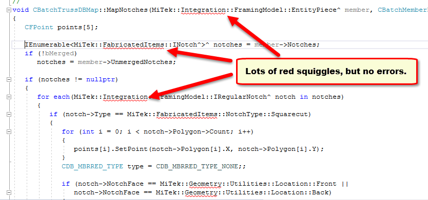

## The Necessity of Formatting

When we learn a new language, one of the first things you learn are getting the grammer and the sentence structure. When these structures are incorrect when formulating a sentence what you are trying to say can be hard to understand or even worse incohearent. After being introduced to the basics of Javascript, I was introduced to the "Coding Standards" and ESlint of IntelliJ, which is a way of formatting my code "correctly." On one side of the story the coding standards could be helpful in a way that you can help other people understand your code better. Howevever, are these coding standards really necessary? 

## Is It Really Better?

From my experience, everyone has a different style of implementing working code. Before moving to IntelliJ IDEA, I was using JSFiddle for all my Javascript practicing needs. JSFiddle not having a code quality filter like IntelliJ I was able to format my code in any way I want, however I want. First week on my transition to IntelliJ IDEA, I found that the code correctional tool "ESlint" really likes to nidpick on code formatting. Anything from making you use const instead of let inside functions, and needing a space before you start your commenting, it can be quite tedious to meet all of these standards. I can understand that it helps with formatting, However, I feel that many of the code suggestions are unnecessary and just "suggestions."

## Its All About Consistency

Now the question we ask is, "is that green checkmark on the top right a benefit or a burden?" Refering back to my first statement, everyone should have their own way of organizing their code. That being said, if the person coding has a consistent coding style that is not following the format of the ESlint code quality tool it should not be a bad thing. All in all, my opinion about coding standards stay the same, there may be many different ways to structure your arguments, but as long as what you are writing is well structured and consistent It should not matter.