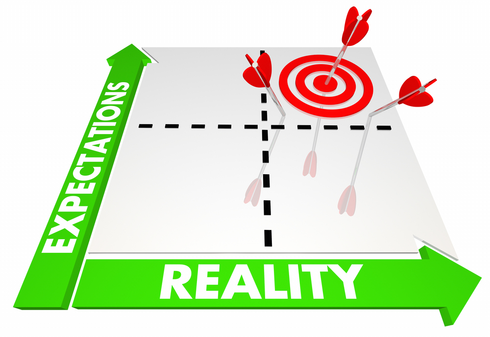

## Satisfying my Learning

  By no means of the stretch am I an exceptionally talented learner. Whether it comes to learning a new coding language or any other subject of the matter. However what I learn in computer science classes are challenging most of the time. I feel that the material that we will learn in software engineering will stick with me throughout all my carrer. Software engineering is one of those things that always changes and evolves to present a new problem and solution, this will provide me with the skills to stick by to tackle the upcoming problems.
  
  
  
## Coding and Its Challenges 

  Personally speaking, I am a slow learner. It takes me a while to learn new concepts in coding and another extra step to apply them in assignments. That being said I have heard from my friends that this class teaches you crucial things you need to know like Object-orientation, being able to solve problems, and being able to communicate with your group members. In addition to this I would like to improve on my own coding skills so I am not stuck on one aspect of my code at all times.
  
  
  
## Expectations

 For me I have a certain amount of expectations for this class and this semester as a whole. As stated earlier I am not the best when it comes to picking things up in a fast pace, however I am hoping that learning more software engineering lets me engage more during these coding exercises to help me pick up the learning pace. For the most part I am excited to learn Javascript, the coding challenges give me a sense of excitement when it comes to applying what I learned before onto a new topic. 
  
