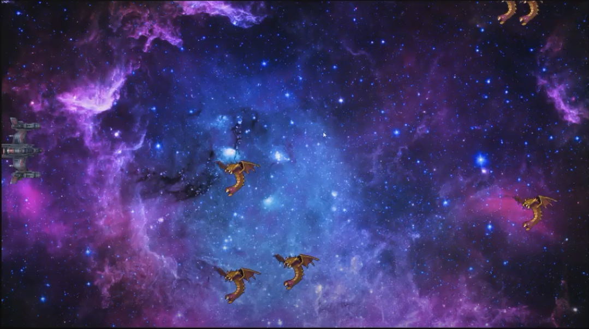

  
  

Kill the Mutas is one of my game projects for my ICS 111 class in spring 2019. The objective of this game is to not let the mutalisks that come from the right side of the screen
get to the left side of the screen.

Kill the Mutas is coded using Java and the EZjava library.The player can use the arrow keys to move up and down the screen, however they cannot move left or right of the screen adding to the difficulty. When the mutalisks are shot there will be another mutalisk that will be spawned at a random position and random moving speed on the rightmost side of the screen. You cannot "win" in this game however the point of the game is to see how long you can survive the mutalist attacks.

You can learn more at the [Youtube video](https://www.youtube.com/watch?v=WgVMzIvhTlM&feature=youtu.be).

