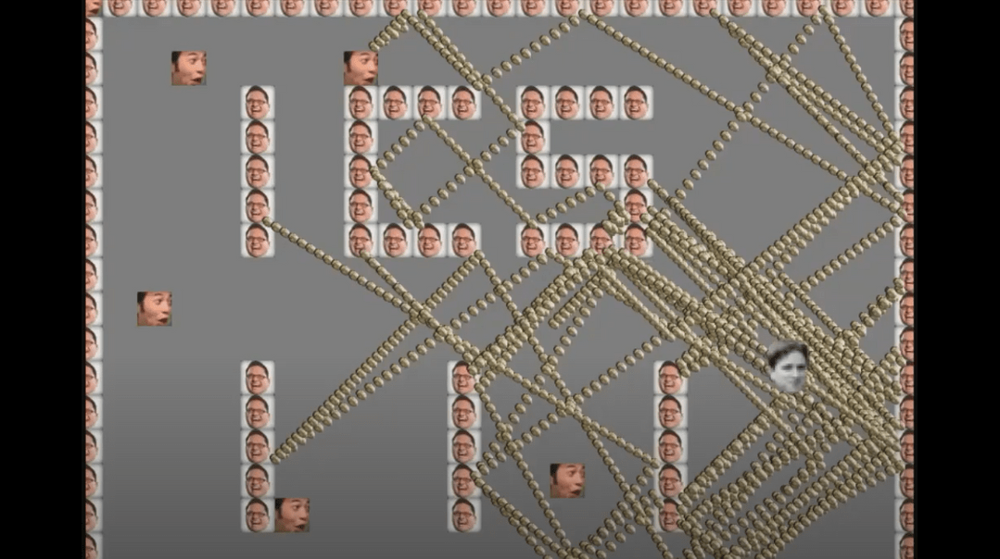

This program was for my ICS 111 class. It generates a map then loads in the main "roomba" in the middle. The robot vaccum will then navigate around the map bouncing off the walls until it has collected all the designated dirt pieces.

 You can learn more at the [Youtube video](https://www.youtube.com/watch?v=z9mVjyQFwkM&feature=youtu.be).
