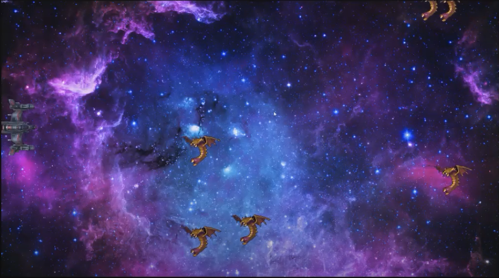

  
  

This was one of the projects for my ICS 111 class.
The objective of this game is to not let the mutalisks that come from the right side of the screen
get to the left side of the screen.

You can learn more at the [Youtube video](https://www.youtube.com/watch?v=WgVMzIvhTlM&feature=youtu.be).

