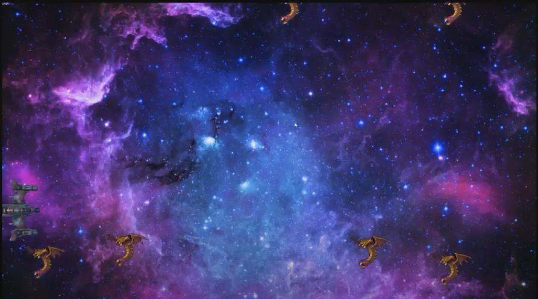

  
  

Kill the Mutas is one of my game projects for my ICS 111 class in spring 2019. The objective of this game is to not let the mutalisks that come from the right side of the screen
get to the left side of the screen.

Kill the Mutas is coded using Java and the EZjava library.

You can learn more at the [Youtube video](https://www.youtube.com/watch?v=WgVMzIvhTlM&feature=youtu.be).

